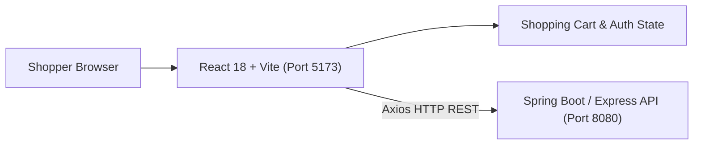
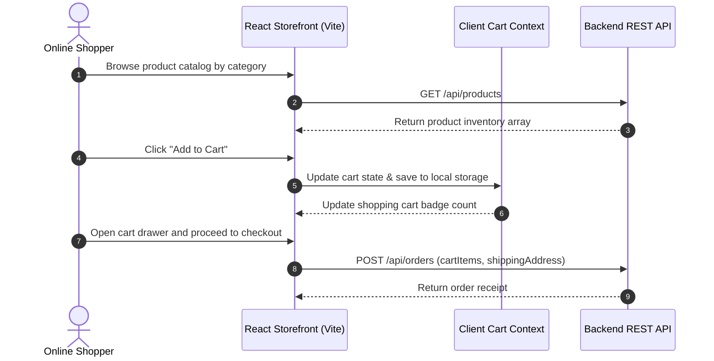

# ShopPulse E-Commerce — Modern React Client Application
[]()
[]()
[]()
[]()

## Overview
A dynamic, modern e-commerce storefront frontend developed with React 18, Vite, and Tailwind CSS. Designed to connect seamlessly with Java Spring Boot or Node.js microservices, it provides catalog browsing, product filtering, shopping cart management, and customer authentication.

- **Problem Solved:** Fast, client-side rendered shopping experience with instant state updates.
- **Target Users:** Online retail shoppers and store administrators.
- **Current Status:** Functional Web Application.

## Features
- **Product Showcase:** Category filtering, product cards, pricing, and high-resolution product imagery.
- **Persistent Shopping Cart:** Client-side cart state management with real-time total calculation.
- **User Authentication:** Login and registration views connected to JWT authentication endpoints.
- **Responsive Layout:** Tailored layout for mobile, tablet, and desktop viewports.

## Architecture


## User Flow


## Technology Stack
| Layer | Technology | Purpose |
|---|---|---|
| Framework | React 18, Vite | Component hierarchy and high-speed build |
| Styling | Tailwind CSS | Modern responsive design system |
| State Management | React Context / Hooks | Cart state and customer session |
| HTTP Client | Axios / Fetch API | Asynchronous API communication |

## Infrastructure
- **Development Port:** 5173
- **Target API Port:** 8080 (or 5000)

## Project Structure
```text
frontend/
├── public/              # Static assets and category photography
├── src/
│   ├── components/      # ProductCard, Navbar, CartDrawer, Hero
│   ├── context/         # CartContext, AuthContext
│   ├── services/        # API service adapters
│   ├── App.jsx          # Root view controller
│   └── main.jsx         # React mounting entry
├── index.html           # HTML template
├── package.json         # Dependencies
├── vite.config.js       # Vite configuration
├── .gitignore           # Git ignore definitions
└── README.md            # Technical documentation
```

## Prerequisites
- Node.js >= 18.x
- npm >= 9.x

## Environment Variables
Copy `.env.example` to `.env` and configure placeholders:
```env
VITE_API_BASE_URL=http://localhost:8080/api
```

## Local Development Setup
1. Clone the repository:
   ```bash
   git clone https://github.com/Bhanutejanallamothu/frontend.git
   cd frontend
   ```
2. Install dependencies:
   ```bash
   npm install
   ```
3. Run development server:
   ```bash
   npm run dev
   ```
4. Access web store at `http://localhost:5173`.

## Docker Setup
*Not detected in repository. Deployable as static assets via Nginx.*

## Database Setup
*Not applicable. State managed via backend REST API.*

## API Documentation
Consumes backend endpoints:
- `GET /api/products` - Loads product inventory.
- `POST /api/auth/login` - Authenticates user.
- `POST /api/orders` - Submits order.

## Deployment
Build static assets:
```bash
npm run build
```
Deploy the `dist/` directory to Vercel, Netlify, or Cloudflare Pages.

## Security
- JWT authentication tokens stored securely in memory / HTTP-only cookies.
- Input validation on checkout forms.

## Testing
```bash
npm run lint
```

## Troubleshooting
- **API Requests Failing:** Ensure the backend service is running and `VITE_API_BASE_URL` is set correctly.

## Future Improvements
- Checkout integration with Stripe Elements.
- Product search autocompletion with debounced queries.

## License
No formal open-source license provided. All rights reserved by repository owner.
